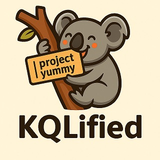

# 🐨 KQLified - Get Qualified in KQL




> **The fun, interactive way to become KQLified! Master threat detection and investigation with hands-on KQL scenarios across Microsoft 365, Azure, AWS, and Kubernetes environments.**

  

### Fixed
- **CRITICAL**: Infinite loop in overview stats refresh system
- Home button functionality and navigation
- goHome() function definition and global availability
- Console spam from 404 errors on coming-soon challenges
- Mobile sidebar behavior after home navigation

### Added
- Auto-redirect to home page after challenge completion
- Home button in header navigation with hover effects
- Completion success banner on home page
- Enhanced completion animations and user feedback

## 🚀 Quick Start

```bash
# Clone and run locally
git clone https://github.com/your-username/KQLified.git
cd KQLified
jekyll serve --livereload

# Visit: http://localhost:4000
```

## ✨ What Makes KQLified Special

- **🎯 0 to KQLified in Hours**: Get analysts productive with KQL fast
- **🐨 Fun Learning Experience**: Gamified progression
- **📊 Progressive Skill Building**: 5-level stacking hint system that builds expertise step-by-step
- **🧠 Detective Walkthroughs**: Understand the "why" behind every query like a pro
- **🌍 Multi-Cloud Coverage**: Microsoft 365, Azure, AWS, Kubernetes scenarios
- **📱 Production Ready**: Enhanced educational features with zero-risk architecture

## 🎯 For Different Users

### 👩‍💻 **Security Analysts & Students**
Ready to learn? Just visit the platform and start with "Password Spray Attack Detection"
- No setup required for learning
- Progressive difficulty from beginner to expert
- Real-world scenarios with authentic data

### 🛠️ **Developers & Contributors**
Want to add challenges or improve the platform?
- **[📖 Developer Guide](docs/DEVELOPER.md)** - Architecture, coding standards, testing
- **[➕ Adding Challenges](docs/ADDING_CHALLENGES.md)** - Step-by-step guide with templates
- **[🤝 Contributing](docs/CONTRIBUTING.md)** - Pull request process and guidelines

### 🏫 **Educators & Trainers**  
Want to use this in your curriculum?
- **[📚 Educator Guide](docs/EDUCATOR.md)** - Pedagogical approach and customization
- **[📋 Content Standards](docs/CONTENT_STANDARDS.md)** - Quality guidelines and best practices

### 🔧 **DevOps & Maintainers**
Managing deployment and operations?
- **[🚀 Deployment Guide](docs/DEPLOYMENT.md)** - GitHub Pages, CI/CD, performance monitoring
- **[🔧 Troubleshooting](docs/TROUBLESHOOTING.md)** - Common issues and solutions

## 🏗️ Architecture Overview

**Modern, Modular Design:**
- **Frontend**: JavaScript with no heavy frameworks
- **Static Site**: Jekyll for GitHub Pages compatibility
- **Data**: CSV (realistic logs) + KQL (expert solutions) + JSON (educational content)
- **Enhancement Pattern**: Progressive features with graceful fallbacks

```
📁 KQLified/
├── 🏠 index.html                    # Main application
├── 📁 assets/
│   ├── 📁 js/                       # Core logic + enhanced features  
│   ├── 📁 css/                      # Responsive styling
│   └── 📁 data/scenarios/           # Challenge data + educational content
└── 📁 docs/                         # Detailed documentation (separate files)
```

## 📊 Current Status

**✅ Ready to Get You KQLified:**
- ✅ Interactive KQL query editor with validation
- ✅ Progressive 5-level hint system
- ✅ Detective-style walkthrough explanations
- ✅ XP system with ranks and certificates
- ✅ Recovery codes for progress backup
- ✅ Mobile-responsive design

**🎯 Available Challenges:**
- ✅ **Password Spray Detection** (Beginner-Intermediate) - *Full enhanced content*
- 🚧 **Brute Force Analysis** (Beginner) - *In development*
- 📋 **41 More Planned** across 5 cloud platforms

## 🛠️ Quick Tasks

### Add a New Challenge (10 minutes)
```bash
# 1. Copy template
cp -r assets/data/scenarios/password-spray assets/data/scenarios/my-challenge

# 2. Update files
# - Edit my-challenge/signin-logs.csv (your training data)
# - Edit my-challenge/solution.kql (expert solution)  
# - Edit my-challenge/my-challenge.json (hints & walkthrough)

# 3. Register in scenarios.json + index.html navigation
# 4. Test locally with: jekyll serve
```

### Test a Feature
```javascript
// Toggle between original and enhanced systems
enableEnhancedSystem();  // Use new progressive hints
disableEnhancedSystem(); // Fallback to original
```

**Scaling Strategy:**
- Modular architecture supports 100+ challenges
- Progressive enhancement prevents breaking changes
- Lazy loading for performance at scale

## 🤝 Contributing

We welcome contributions! Whether you're:
- **🛡️ Security Professional**: Share real-world scenarios and detection logic
- **👩‍💻 Developer**: Improve platform features and performance  
- **🏫 Educator**: Enhance learning content and progression
- **🧪 QA Tester**: Find bugs and edge cases

**See [CONTRIBUTING.md](docs/CONTRIBUTING.md) for detailed guidelines.**

## 📞 Support

- **🐛 Found a bug?** → [Create an Issue](https://github.com/your-username/KQLified/issues)
- **💡 Feature idea?** → [Start a Discussion](https://github.com/your-username/KQLified/discussions)
- **❓ Need help?** → Check [Troubleshooting Guide](docs/TROUBLESHOOTING.md)

## 🎬 What's Next

**Immediate Priorities:**
1. **Complete brute-force challenge** with enhanced content
2. **GitHub feedback integration** for user suggestions  
3. **S3 ransomware scenario** (advanced challenge)

**Roadmap:**
- **Phase 1**: Complete Microsoft 365 scenarios (6 total)
- **Phase 2**: Add Azure platform scenarios (8 challenges)
- **Phase 3**: AWS and Kubernetes expansion
- **Phase 4**: Community features and integrations

---

**🎯 Ready to get KQLified? [Start Your Journey →](https://your-username.github.io/KQLified)** 🐨

---

## 📁 Documentation Structure

This project uses **focused documentation** split into specific guides:

| Document | Purpose | Audience |
|----------|---------|----------|
| **README.md** (this file) | Project overview and quick start | Everyone |
| **[docs/DEVELOPER.md](docs/DEVELOPER.md)** | Architecture, code standards, API reference | Developers |
| **[docs/ADDING_CHALLENGES.md](docs/ADDING_CHALLENGES.md)** | Step-by-step challenge creation | Contributors |
| **[docs/EDUCATOR.md](docs/EDUCATOR.md)** | Pedagogical approach and customization | Educators |
| **[docs/DEPLOYMENT.md](docs/DEPLOYMENT.md)** | Hosting, CI/CD, performance monitoring | DevOps |
| **[docs/TROUBLESHOOT.md](docs/TROUBLESHOOT.md)** | Common issues and solutions | Maintainers |
| **[docs/CONTRIBUTIONS.md](docs/CONTRIBUTIONS.md)** | Contribution guidelines and standards | Contributors |
| **[docs/CONTENT_STANDARDS.md](docs/CONTENT_STANDARDS.md)** | Educational content quality guidelines | Content creators |

**💡 Each document is focused, actionable, and serves a specific need.**