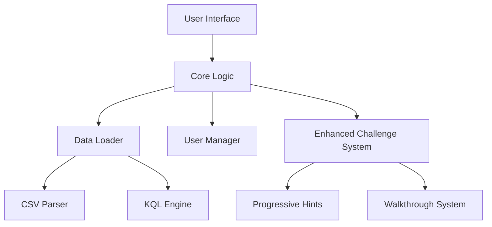

# 🛠️ Developer Guide

> **Architecture, coding standards, and technical implementation details for KQL Security Training Platform.**

## 🏗️ Architecture Overview

### Core Design Principles

1. **Progressive Enhancement**: New features add value without breaking existing functionality
2. **Zero-Risk Deployment**: Feature flags allow safe rollbacks
3. **Modular Design**: Independent components with clear interfaces
4. **Append-Only Strategy**: Never modify existing code, only extend it

### System Architecture



## 📁 Code Organization

### Key Files and Responsibilities

| File | Purpose | Key Functions |
|------|---------|---------------|
| `assets/js/script.js` | Core app logic + enhanced features | `loadScenario()`, `runQuery()`, enhanced system |
| `assets/js/data-loader.js` | Data processing and KQL execution | `loadScenarioData()`, `executeQuery()` |
| `assets/js/user-manager.js` | Progress tracking and gamification | `completeScenario()`, `addXP()` |
| `index.html` | Main UI structure | Static HTML with dynamic content areas |
| `assets/css/style.css` | Complete styling system | Responsive design + animations |

### Data Flow

```javascript
// 1. User selects challenge
selectScenario('password-spray') 
  → loadEnhancedScenario('password-spray')
  → loadScenarioData() + loadEnhancedChallengeContent()

// 2. User writes query
runQuery() 
  → executeQuery() 
  → validateAttackDetection() 
  → displayResults() + awardXP()

// 3. User gets help
toggleEnhancedHint() 
  → displayEnhancedStackedHints() 
  → showEnhancedNextHint()
```

## 🧩 Component Details

### Enhanced Challenge System

**Location**: `assets/js/script.js` (lines 500+)
**Purpose**: Progressive hints and walkthrough functionality

```javascript
// Key classes and functions
let enhancedChallengeContent = null;  // Cached challenge data
let enhancedHintLevel = 0;           // Current hint progression
let enhancedDisplayedHints = [];     // Stack of shown hints

// Main functions
async function loadEnhancedChallengeContent(scenarioId)
function displayEnhancedStackedHints()
function showEnhancedKQLWalkthrough()
```

### Data Loader Engine

**Location**: `assets/js/data-loader.js`
**Purpose**: CSV parsing and simplified KQL execution

```javascript
class DataLoader {
    // Core methods
    async loadScenarioData(scenarioId)     // Load CSV + KQL files
    executeQuery(queryText, data)         // Execute user queries
    executeBasicKQLQuery(query, dataset)  // Simplified KQL engine
    validateQuery(userQuery, scenarioId)  // Check results
}
```

**Supported KQL Operators**:
- `where` (basic conditions)
- `summarize` (grouping and aggregation) 
- `order by` (sorting)
- `extend` (calculated fields)
- `dcount()`, `count()`, `make_set()`, `min()`, `max()`

### User Management System

**Location**: `assets/js/user-manager.js`
**Purpose**: Progress tracking, XP, and certificates

```javascript
class UserManager {
    // Progress tracking
    completeScenario(scenarioName, xpReward)
    addXP(points, scenarioName)
    
    // Recovery system
    generateCompletionCode(scenarioId)
    validateCompletionCode(code)
    generateAndShowCertificate()
}
```

## 🔧 Development Workflow

### Local Development Setup

```bash
# 1. Clone and setup
git clone https://github.com/your-username/KQLified.git
cd KQLified

# 2. Install Jekyll
gem install jekyll bundler
# or: brew install ruby && gem install jekyll bundler

# 3. Run development server
jekyll serve --livereload
# Site available at: http://localhost:4000

# 4. Make changes and test
# Changes auto-reload in browser
```

### Feature Development Pattern

```javascript
// 1. Always use feature flags for new functionality
const useNewFeature = true;

function someFunction() {
    if (useNewFeature) {
        return enhancedFunction();  // New implementation
    } else {
        return originalFunction();  // Fallback
    }
}

// 2. Maintain backward compatibility
function enhancedFunction() {
    try {
        // New feature implementation
        return newLogic();
    } catch (error) {
        console.warn('Enhanced feature failed, falling back:', error);
        return originalFunction();  // Graceful fallback
    }
}
```

### Testing Checklist

**Before committing changes:**
- [ ] `jekyll serve` runs without errors
- [ ] Console shows no JavaScript errors
- [ ] Challenge loads and functions correctly
- [ ] Progressive hints display properly
- [ ] Query execution works as expected
- [ ] XP system awards points correctly
- [ ] Feature flags allow disabling new functionality

## 📊 Performance Guidelines

### Performance Targets
- **Page Load**: < 2 seconds
- **Challenge Load**: < 1 second  
- **Query Execution**: < 500ms
- **Memory Usage**: < 30MB per session

### Optimization Techniques

```javascript
// 1. Efficient CSV processing
const parsedData = Papa.parse(csvText, {
    header: true,
    dynamicTyping: true,
    skipEmptyLines: true,
    delimitersToGuess: [',', '\t', '|', ';']
});

// 2. Debounced query execution
const debouncedRunQuery = debounce(runQuery, 300);

// 3. Cached results
const queryCache = new Map();
function executeQuery(query, data) {
    const cacheKey = `${query}-${data.length}`;
    if (queryCache.has(cacheKey)) {
        return queryCache.get(cacheKey);
    }
    // Execute and cache...
}
```

## 🔌 API Reference

### Core Functions

#### `selectScenario(scenarioId)`
**Purpose**: Load and display a challenge
```javascript
selectScenario('password-spray');
// Loads challenge data, updates UI, switches to challenge view
```

#### `loadEnhancedChallengeContent(scenarioId)`
**Purpose**: Load educational content from JSON
```javascript
const content = await loadEnhancedChallengeContent('password-spray');
// Returns: { progressiveHints: [...], walkthrough: {...} }
```

#### `executeQuery(queryText, data)`
**Purpose**: Execute KQL query on dataset
```javascript
const result = dataLoader.executeQuery(userQuery);
// Returns: { success: boolean, data: [...], error?: string }
```

### Event System

```javascript
// Key events you can hook into
document.addEventListener('DOMContentLoaded', function() {
    // Platform initialization
});

// Challenge lifecycle events
function onChallengeLoaded(scenarioId) { /* Custom logic */ }
function onQueryExecuted(results) { /* Custom logic */ }
function onHintRequested(level) { /* Custom logic */ }
```

## 🧪 Testing Framework

### Manual Testing Protocol

```javascript
// 1. Feature flag testing
enableEnhancedSystem();
testChallengeLoad('password-spray');

disableEnhancedSystem(); 
testChallengeLoad('password-spray'); // Should still work

// 2. Error injection testing
// Temporarily break JSON file to test fallbacks
// Remove network connection to test offline behavior

// 3. Performance testing
console.time('Challenge Load');
loadScenario('password-spray');
console.timeEnd('Challenge Load'); // Should be < 1000ms
```

### Browser Testing Matrix

| Browser | Version | Status | Notes |
|---------|---------|--------|-------|
| Chrome | 60+ | ✅ Primary | Recommended for development |
| Firefox | 55+ | ✅ Supported | Good ES6 support |
| Safari | 12+ | ✅ Supported | iOS compatibility |
| Edge | 80+ | ✅ Supported | Chromium-based |

## 🔧 Debugging Tips

### Common Development Issues

**1. "Enhanced challenge content not found"**
```bash
# Check file exists and is valid JSON
ls assets/data/scenarios/challenge-name/challenge-name.json
cat assets/data/scenarios/challenge-name/challenge-name.json | jq .
```

**2. "CSV parsing errors"**
```javascript
// Debug CSV parsing
Papa.parse(csvText, {
    header: true,
    error: function(err) {
        console.error('CSV Parse Error:', err);
    },
    complete: function(results) {
        console.log('Parsed successfully:', results.data.length, 'rows');
    }
});
```

**3. "Query execution fails"**
```javascript
// Check supported operators
const supportedOperators = ['where', 'summarize', 'order by', 'extend'];
// Your query might use unsupported KQL features
```

### Console Commands for Debugging

```javascript
// Inspect current state
console.log('Selected scenario:', selectedScenario);
console.log('Enhanced system active:', useEnhancedSystem);
console.log('Hint level:', enhancedHintLevel);
console.log('User XP:', userManager.getUserXP());

// Force state changes
enhancedHintLevel = 3;
displayEnhancedStackedHints();

// Test functions directly
const result = window.dataLoader.executeQuery('SigninLogs | take 5');
console.log('Query result:', result);
```

## 📝 Code Style Guidelines

### JavaScript Standards

```javascript
// ✅ Good: Descriptive function names with clear purpose
async function loadEnhancedChallengeContent(scenarioId) {
    try {
        console.log(`🚀 Loading enhanced challenge content for: ${scenarioId}`);
        // Implementation...
    } catch (error) {
        console.error(`❌ Failed to load enhanced challenge content: ${error}`);
        return fallbackContent;
    }
}

// ❌ Avoid: Generic names without context
function load(id) { /* unclear purpose */ }

// ✅ Good: Consistent error handling with fallbacks
function enhancedFeature() {
    try {
        return newImplementation();
    } catch (error) {
        console.warn('Enhanced feature failed, using fallback:', error);
        return originalImplementation();
    }
}
```

### CSS Standards

```css
/* ✅ Good: BEM methodology with descriptive names */
.hint-panel__item--latest {
    background: rgba(255, 193, 7, 0.15);
    animation: hintGlow 0.5s ease;
}

/* ✅ Good: CSS custom properties for consistency */
:root {
    --primary-color: #2c5aa0;
    --warning-color: #ff9800;
    --success-color: #4caf50;
}

/* ✅ Good: Mobile-first responsive design */
.challenge-panel {
    padding: 1rem;
}

@media (min-width: 768px) {
    .challenge-panel {
        padding: 2rem;
    }
}
```

## 🚀 Deployment Considerations

### Build Process
```bash
# Jekyll builds static site automatically
jekyll build
# Output in _site/ directory

# For GitHub Pages, just push to main branch
git push origin main
# Automatic deployment via GitHub Actions
```

### Performance Monitoring
```javascript
// Key metrics to track
performance.mark('challenge-start');
// ... load challenge
performance.mark('challenge-end');
performance.measure('challenge-load', 'challenge-start', 'challenge-end');

// Log performance data
const entries = performance.getEntriesByType('measure');
console.log('Performance metrics:', entries);
```

---

**🎯 Ready to contribute? Check out [ADDING_CHALLENGES.md](ADDING_CHALLENGES.md) for your first contribution!**